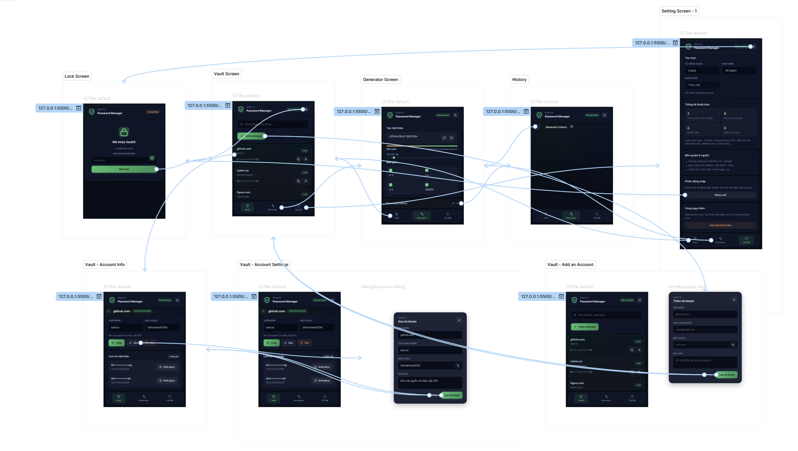

# VaultX

Kho lưu trữ mã nguồn cho đồ án môn học về **Chrome Extension quản lý mật khẩu**.

---

## Cấu trúc thư mục

```text
VaultX/
|-- assets/          # Tài nguyên hình ảnh, icons
|-- docs/            # Tài liệu hướng dẫn và sơ đồ
|-- logic/           # Luồng xử lý chính
|   |-- python/      # Thuật toán viết bằng Python (draft only)
|   |   |-- cryptography.py
|   |   |-- hashtable.py
|   |   |-- kmp.py
|   |   |-- stack.py
|   |   `-- trie.py
|   `-- *.js         # Logic chuyển đổi sang JavaScript
|-- popup/           # Giao diện người dùng (HTML/CSS)
|-- scripts/         # Content scripts cho Extension
|-- manifest.json    # File cấu hình Chrome Extension
|-- .gitignore
`-- README.md
```

Luồng thực thi Prototype (Figma)


